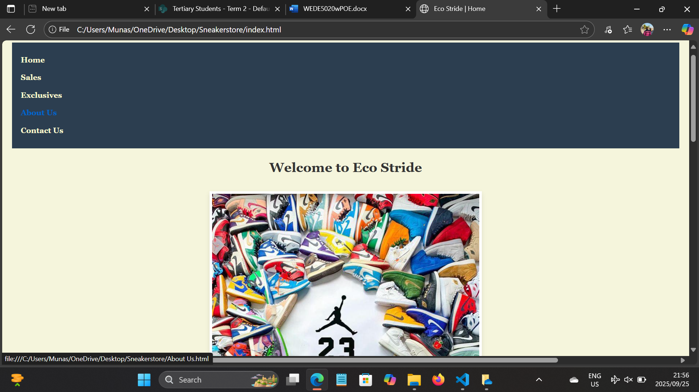

# Sneakerstore
Eco Stride website project:

 This is a website project about a sneaker store called Eco Stride. This website will be used by the store and customers will be able to do their online shopping via the website. View the latest sneakers, do their shopping. The website will be created using HTML, CSS and Java script. All the details about the store will be on the website. The target market for this website is young people who are into footwear as well as sports or just being active. 

 ### How it looks on the browser
 - The first thing a user will see is the home page were we describe what our store is all about
 - On the homepage theres a clickable navigation that will take you to other pages of the website

 ## Features 
 * Home page with navigation bar
 * About us page with the store details
 * Sales page showing sneaker deals
 * Contact page with form
 * Sytlish design using CSS 

 ### The following updates were made to the html website (Part 1) to enhance the website and make it more creatitive with the use of css.

- All the website images have a border around them to fit well on the website
- The logo image was changed to a colourful picture with shoe pictures.
- The navigation section was enhanced by removing the underline.
- The background color for all pages was edited from plain white to light cream white for a better contrast.
- The font was changed for all the pages as well as the font size for readability
- New images were added and the the sizes for all the images was changed to fit the website.

### Future plans
- Add e-commerce functionality for example cart, checkout etc
- Optimize for mobile devices

## Contact 
- For questions, reach out at crispenkuziwa@icloud.com or call 079 399 0961

 

 ## Part 3 - Enhancements
 - Dynamic product rendering with JavaScript
 - Quick view modal and Lightbox
 - Filtering by size, price and color
 - Ajax form submission
 - SEO: meta, sitemap, robots.txt
 - Speed: lazy loading, AVIF
 - Security: CSP headers 